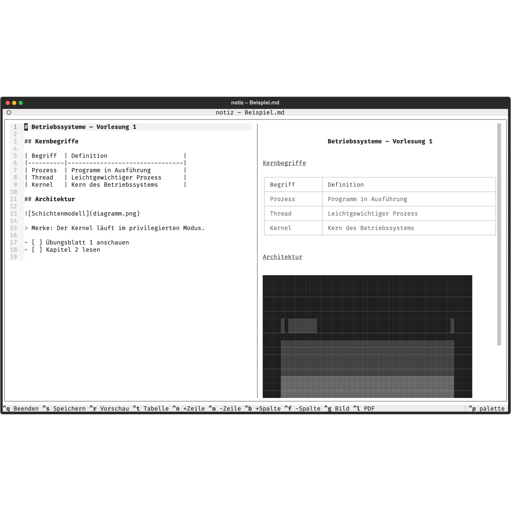

# note

Markdown-Notizen im Terminal: Editor links (normale Navigation, kein Vim),
Live-Vorschau rechts mit gerenderten Tabellen und Bildern, Live-PDF-Export.
Gebaut mit [Textual](https://textual.textualize.io).



## Installation

Läuft auf **macOS, Linux und Windows**. Voraussetzungen: Python 3.10+.
Für den PDF-Export ein Chromium-Browser — auf Windows reicht das
vorinstallierte Edge, auf Linux `chromium`/`google-chrome`, auf macOS
Chrome/Brave/Edge. Für den Bild-Dialog (Ctrl+G) auf Linux: `zenity` (GNOME)
oder `kdialog` (KDE) — meist vorinstalliert.

**1. Repository klonen und Abhängigkeiten installieren:**

macOS / Linux:

```sh
git clone https://github.com/antallpt/note.git
cd note
python3 -m venv .venv
./.venv/bin/pip install -r requirements.txt
```

Windows (PowerShell):

```powershell
git clone https://github.com/antallpt/note.git
cd note
py -m venv .venv
.venv\Scripts\pip install -r requirements.txt
```

**2. Den `note`-Befehl einrichten:**

macOS / Linux — Alias in die Shell-Konfiguration eintragen (im geklonten
Ordner ausführen; für Bash `~/.bashrc` statt `~/.zshrc`):

```sh
echo "alias note='\"$PWD/note\"'" >> ~/.zshrc
source ~/.zshrc
```

Windows — den Projektordner zum PATH hinzufügen (einmalig, PowerShell im
geklonten Ordner):

```powershell
[Environment]::SetEnvironmentVariable("Path", "$env:Path;$PWD", "User")
```

Danach funktioniert `note` in jedem neuen Terminal (Windows nutzt dabei
automatisch `note.cmd`).

**3. Ausprobieren** — die Beispielnotiz öffnen:

```sh
note beispiel/Beispiel.md
```

## Benutzung

Der `note`-Befehl funktioniert aus jedem Verzeichnis:

```sh
note vorlesung-01        # öffnet vorlesung-01.md – wird angelegt, falls nicht vorhanden
note bs/kapitel-2.md     # Unterordner werden bei Bedarf mit angelegt
note                     # öffnet ./Notizen.md
```

Ohne Dateiendung wird automatisch `.md` angehängt. Ohne Alias geht auch
immer `./note datei` direkt aus dem Projektordner.

## Tastenkürzel

| Kürzel  | Aktion                          |
|---------|---------------------------------|
| Ctrl+S  | Speichern (rendert die Vorschau neu) |
| Ctrl+Q  | Speichern & Beenden             |
| Ctrl+R  | Vorschau ein-/ausblenden        |
| Ctrl+T  | Tabellen-Gerüst einfügen        |
| Ctrl+N  | Tabellenzeile hinzufügen        |
| Ctrl+O  | Tabellenzeile entfernen         |
| Ctrl+B  | Tabellenspalte hinzufügen       |
| Ctrl+F  | Tabellenspalte entfernen        |
| Ctrl+G  | Bild über Finder-Dialog auswählen |
| Ctrl+L  | Live-PDF-Vorschau an/aus        |
| Ctrl+Z / Ctrl+Y | Rückgängig / Wiederherstellen |
| Ctrl+P  | Befehlspalette (Textual)        |

Die Tabellen-Kürzel wirken auf die Tabelle, in der der Cursor gerade steht.
Die Vorschau aktualisiert sich zusätzlich automatisch ~0,5 s nach der letzten
Eingabe.

Alle Kürzel sind auch mit Cmd statt Ctrl hinterlegt — das funktioniert aber
nur in Terminals, die Cmd an Programme durchreichen (Ghostty, kitty, WezTerm).
Apple Terminal behält Cmd-Kürzel für sich (Cmd+Q würde das Terminal beenden).

## Tabellen

Ctrl+T fügt ein leeres Tabellen-Gerüst ein (der Cursor landet in der ersten
Zelle), Ctrl+N/O/B/F ändern Zeilen und Spalten. Tabellen werden beim Schreiben
**automatisch bündig ausgerichtet** — ~0,5 s nach der letzten Eingabe; der
Cursor bleibt dabei in seiner Zelle.

## Bilder

Ein Bild erscheint in der Vorschau, wenn sein Link allein auf einer Zeile steht:
`` — Pfade relativ zur Notiz-Datei.

**Ctrl+G öffnet den nativen Datei-Dialog** (macOS: Finder, Linux:
zenity/kdialog, Windows: Explorer) — Bild auswählen, und es wird an der
Cursorposition verlinkt (auf eigener Zeile, mit markiertem Titel).

Auch **Drag & Drop aus dem Finder** und von Hand getippte Pfade zu
existierenden Bildern werden automatisch in Links umgewandelt (~0,5 s nach der
Eingabe). Liegt das Bild im Ordner der Notiz, wird der Link relativ.

Nach dem Verlinken ist der **Titel markiert** (vorbelegt mit dem Dateinamen) —
einfach lostippen, um ihn zu ersetzen; Pfeiltaste rechts behält ihn. Der Titel
erscheint in der Vorschau als Bildunterschrift unter dem Bild.

Die Darstellungsqualität hängt vom Terminal ab: Apple Terminal und ältere
Windows-Terminals beherrschen kein Grafikprotokoll, dort werden Bilder als
farbige Pixelblöcke gerendert — **ein Klick auf ein Bild in der Vorschau
öffnet es in voller Qualität im Standard-Bildbetrachter.**
kitty/Ghostty/iTerm2/WezTerm (und Windows Terminal ab 1.22 via Sixel) zeigen
Bilder direkt scharf an.

## Live-PDF-Vorschau

**Ctrl+L** erzeugt neben der Notiz eine PDF-Datei (gleicher Name, `.pdf`) und
öffnet sie im PDF-Viewer des Systems. Solange die PDF-Vorschau an ist, wird das
PDF bei jedem Speichern (Ctrl+S) neu erzeugt — der Viewer lädt es automatisch
neu. Tabellen und Bilder werden dabei in voller Qualität gerendert.

Der Export nutzt einen installierten Chrome/Chromium/Brave/Edge als
PDF-Renderer (headless; auf Windows wird das vorinstallierte Edge gefunden).
Das PDF eignet sich auch direkt zum Abgeben oder Teilen. Auf Linux laden
Evince (GNOME) und Okular (KDE) geänderte PDFs von selbst nach; auf Windows
empfiehlt sich dafür SumatraPDF.

Das PDF nutzt eine abgestufte Grau-Palette (Tailwind-„Neutral"-Skala,
WCAG-AA-geprüft): Haupttitel dunkelgrau (#262626), Unterüberschriften
abgestuft (#404040, #525252), Fließtext hellgrau (#737373), Tabellenkopf
als Zwischenstufe (#525252 auf #f5f5f5) mit Zebra-Streifen, dezente graue
Aufzählungspunkte.

Nur macOS: Da Preview.app geänderte PDFs erst beim Fokussieren neu lädt, stupst die App
das Fenster nach jedem Export kurz an und gibt den Fokus sofort ans Terminal
zurück (kurzes Flackern). Komplett flackerfrei wird es mit
[Skim](https://skim-app.sourceforge.io) (`brew install --cask skim`): Ist Skim
installiert, nutzt die App es automatisch — in den Skim-Einstellungen unter
„Sync" das automatische Neuladen bei Dateiänderungen aktivieren.

## Entwicklung

Einstieg: `app.py`. Beispielnotiz: `beispiel/Beispiel.md`.
Smoke-Test: `./.venv/bin/python smoke_test.py`
