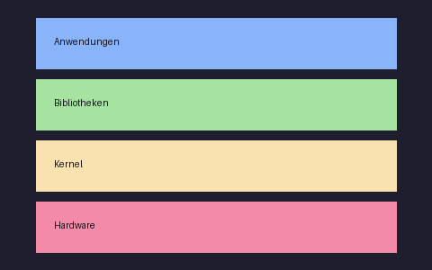

# Betriebssysteme – Vorlesung 1

## Kernbegriffe

| Begriff  | Definition                     |
|----------|--------------------------------|
| Prozess  | Programm in Ausführung         |
| Thread   | Leichtgewichtiger Prozess      |
| Kernel   | Kern des Betriebssystems       |

## Architektur

> Merke: Der Kernel läuft im privilegierten Modus.

- [ ] Übungsblatt 1 anschauen
- [ ] Kapitel 2 lesen
